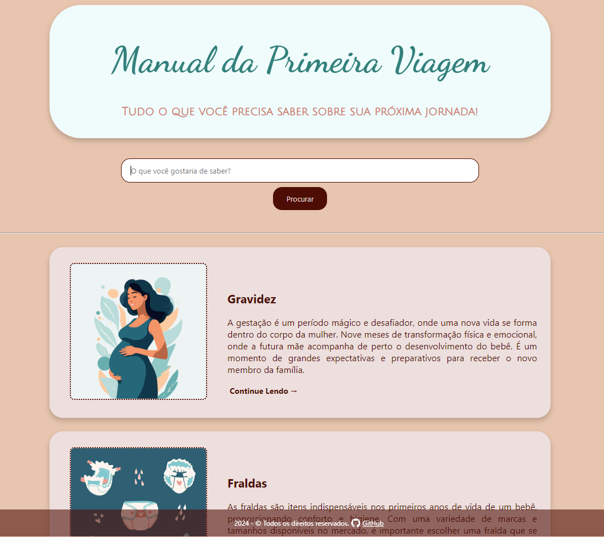

# Manual da Primeira Viagem
#### Curadoria de informações para você que será mãe/pai pela primeira vez!

## O que é esse projeto?

Esse projeto nasceu de uma dor minha: entrar no mundo da maternidade sem saber absolutamente NADA, e, ao me deparar com a avalanche de informações da internet, ficar mais perdida do que antes (se é que era possível).

Uma vez que tive alguns meses para me preparar (psicologicamente, emocionalmente, financeiramente), fiz tanta, mas TANTA pesquisa, que gostaria de poupar o tempo das próximas pessoas que passarão por essa experiência. Afinal, todo esse conhecimento precisa ir para algum lugar, nem que seja só pra sair da minha cabeça e ir para o "papel".

Com o Manual da Primeira Viagem, você pode pesquisar por qualquer assunto relacionado a essa jornada maravilhosa que é a maternidade, tudo em um só lugar.

Encontrará dicas, informações sobre tudo, desde a gravidez até os marcos mais avançados de desenvolvimento do seu bebê e como ter uma ideia (nunca dá pra saber com certeza) se você está na direção certa.

**Um projeto que te ajudará a ser protagonista da sua maternidade.**

## Como funciona?

- **Faça sua pesquisa:** Digite qualquer palavra-chave relacionada à maternidade na barra de pesquisa.
- **Encontre seus resultados:** O site irá procurar por informações relevantes em um banco de dados e te mostrar os resultados mais pertinentes em forma de pequenos artigos, sempre direto ao ponto.
- **Explore as opções:** Clique nos resultados para ver o artigo completo sobre cada assunto.

### Como usar esse projeto:

Ele está hospedado na Vercel: https://imersao-dev-google-gemini-liart.vercel.app/

## Melhorias futuras:

- Layout responsivo;
- Incrementar banco de dados com artigos;
- TAGS de busca padronizadas na página inicial;

## Para desenvolvedores:

### Esse projeto é construído com:

- HTML;
- CSS;
- JavaScript;

### Contribuições:

Se você quiser ajudar a melhorar esse projeto, fique à vontade para enviar um pull request. Qualquer contribuição é bem-vinda!

### Observações:

- Banco de dados: Os dados utilizados nesse projeto são armazenados no arquivo **dados.js**. Você pode adicionar ou modificar esses dados para personalizar o conteúdo dos artigos.
- Próximas features: Existem diversas possibilidades para melhorar esse projeto, como adicionar filtros de pesquisa mais avançados, tornar o layout responsivo, etc.

Projeto desenvolvido durante a <a href="https://grupoalura.notion.site/Imers-o-Dev-com-Gemini-Guia-de-Mergulho-7742af09c51649348a91f67157df8a41#b6d0c71409304997a9e213fd5038e85f" target="_blank">Imersão Dev da Alura com Google Gemini</a>

#### #imersao-dev-google-gemini #desenvolvimentoweb #javascript #maternidade #alura #google #artigos #html #css
